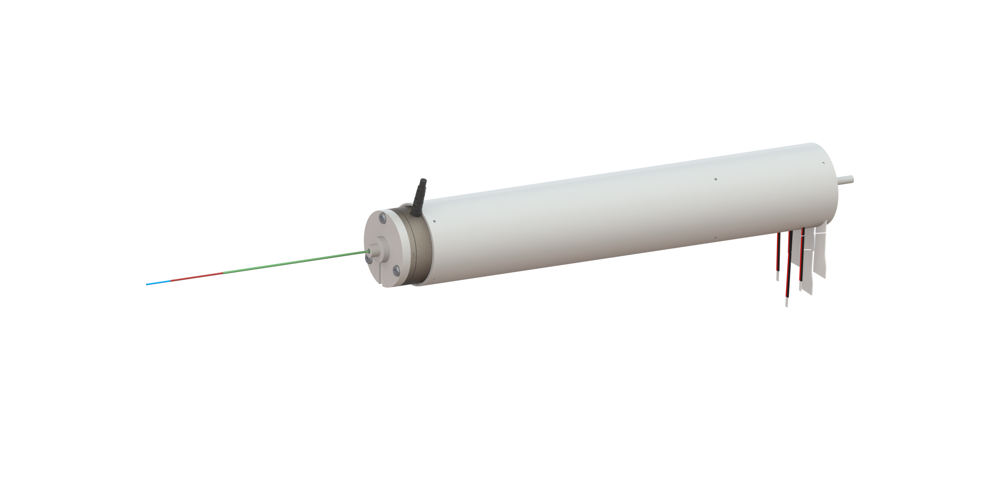

# Concentric Tube Robot — Kinematics Library

[](https://github.com/fcpedrosa/Concentric-Tube-Robot/actions/workflows/ci.yml)
[](https://fcpedrosa.github.io/Concentric-Tube-Robot/)
[](LICENSE)

A C++23 library implementing the forward and inverse kinematics of a
**three-tube concentric tube robot (CTR)**, based on the Cosserat-theory
kinematic model of Rucker, Jones & Webster (*IEEE Transactions on Robotics*,
2010) [[1]](#references).

<p align="center">
  
</p>

## Features

- **Forward kinematics** as a shooting-method boundary value problem over the
  15-dimensional Cosserat state, integrated with a deterministic fixed-step
  RK4 (tip accuracy ≈ 3×10⁻¹¹ m at the default 1 mm step).
- **Inverse kinematics** via damped least squares with Levenberg–Marquardt
  step control, built on the *exact* total kinematic Jacobian (implicit
  function theorem on the shooting residual). Typical solve: a few
  milliseconds, warm-started tracking ≈ 1 ms per 2 mm step.
- **Honest results**: `FKResult`/`IKResult` report convergence, iterations
  and the achieved error; `IKResult::converged` means the tip actually
  reached the target within tolerance.
- **Four BVP solvers** (modified Newton–Raphson with robust fallbacks —
  default, Levenberg–Marquardt, Powell dog-leg, Broyden), all fixed-size and
  allocation-free in their linear algebra.
- **External loading**: distal point forces and moments are supported; the
  unloaded case automatically uses a reduced 3-unknown fast path.
- SI units everywhere; value-semantic, exception-validated `Tube` type;
  proper CMake package with exported `ctr::kinematics` target.

## Requirements

| Dependency | Version | Notes |
|---|---|---|
| CMake      | ≥ 3.26 | |
| C++ compiler | C++23 | GCC ≥ 13 or Clang ≥ 17 |
| Boost      | ≥ 1.74 | header-only use (Boost.Odeint) |
| Blaze      | ≥ 3.8  | linear algebra |
| Catch2     | v3 (tests only) | found or fetched automatically |

## Building

```sh
git clone https://github.com/fcpedrosa/Concentric-Tube-Robot.git
cd Concentric-Tube-Robot
cmake --preset release
cmake --build --preset release
./build/release/bin/ctr_demo
```

Presets: `dev` (Debug + warnings), `dev-asan` (+ sanitizers), `release`,
`release-native` (`-march=native` + LTO), `bench` (benchmarks).

The library is built as `libctr_kinematics.a`.

## Testing

```sh
ctest --preset release          # full suite
ctest --preset release -L unit  # fast unit tests only
ctest --preset release -LE slow # skip the integration convergence study
```

The regression suite pins golden forward-kinematics values, analytic
anchors (straight-tube, planar arc-chain closed form, twist-rate identity,
rotational equivariance), 4-solver cross-validation, Jacobian correctness
against central differences, and FK → IK → FK round trips.

## Using the library

```cmake
find_package(ctr_kinematics CONFIG REQUIRED)
target_link_libraries(your_app PRIVATE ctr::kinematics)
```

```cpp
#include <ctr/CTR.hpp>
using namespace ctr;

std::array<Tube, NUM_TUBES> tubes = {
    Tube{{.OD = 0.92e-3, .ID = 0.80e-3, .E = 65e9, .G = 24.6e9,
          .ls = 190e-3, .lc = 60e-3, .u_ast = {25.0, 0.0, 0.0}}},   // innermost
    Tube{{.OD = 1.10e-3, .ID = 0.97e-3, .E = 65e9, .G = 24.6e9,
          .ls = 120e-3, .lc = 80e-3, .u_ast = {10.0, 0.0, 0.0}}},
    Tube{{.OD = 1.40e-3, .ID = 1.20e-3, .E = 65e9, .G = 24.6e9,
          .ls = 90e-3,  .lc = 40e-3, .u_ast = {7.14, 0.0, 0.0}}},   // outermost
};

// q = [β₁ β₂ β₃ | α₁ α₂ α₃]: retractions [m] (≤ 0), rotations [rad]
const blaze::StaticVector<double, 6UL> q = {-120e-3, -100e-3, -80e-3, 0, 0, 0};

CTR robot(std::move(tubes), q, 1e-6);

bvp_type guess{};                       // zero-initialized: valid cold start
FKResult fk = robot.actuate(q, guess);  // forward kinematics
IKResult ik = robot.solveIK(target, 5e-4, guess);
```

See [`examples/fk_ik_demo.cpp`](examples/fk_ik_demo.cpp) for the complete
runnable example, and the
[documentation](https://fcpedrosa.github.io/Concentric-Tube-Robot/) for the
mathematical model, conventions and API reference.

## Conventions (summary)

- **SI units everywhere**: meters, radians, Pascals, Newtons, 1/m.
- Joint vector `q = [β₁, β₂, β₃, α₁, α₂, α₃]`, tubes ordered innermost first.
- The shooting vector (`bvp_type`) is non-dimensionalized to curvature units;
  zero is always a valid cold-start guess, and passing the previous solution
  warm-starts the solve.

## References

[1] D. C. Rucker, B. A. Jones and R. J. Webster III, "A Geometrically Exact
Model for Externally Loaded Concentric-Tube Continuum Robots," *IEEE
Transactions on Robotics*, vol. 26, no. 5, pp. 769–780, Oct. 2010.

## License

This project is licensed under the [MIT License](LICENSE).

## Contact

Filipe C. Pedrosa — [@fcpedrosa](https://github.com/fcpedrosa)
